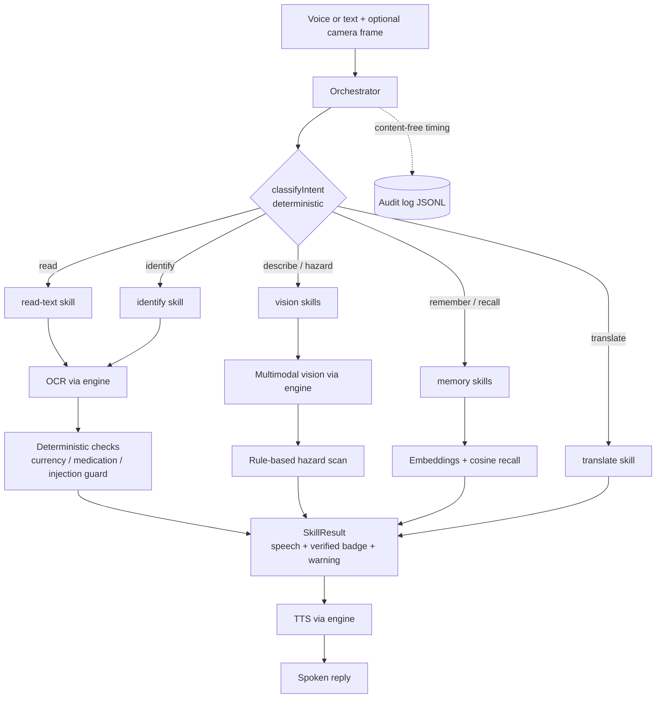

# Architecture

Lantern is a small, layered ES-module app with **dependency inversion** at its
core: the orchestrator and skills depend only on a narrow `LanternEngine`
interface, never on `@qvac/sdk` directly. That single decision buys us testable
green tests (via a mock engine), a no-build-step codebase, and the freedom to run
inference locally **or** delegate it over P2P.

## Layers

```
┌──────────────────────────────────────────────────────────────────────┐
│  Surfaces        Web UI (src/web)            CLI (src/cli)             │
│                  push-to-talk, camera,       one-shot requests,        │
│                  SSE activity stream         scripted demo             │
├──────────────────────────────────────────────────────────────────────┤
│  Orchestrator    src/core/orchestrator.js                             │
│                  intent → skill routing, audit timing, graceful guards │
├──────────────────────────────────────────────────────────────────────┤
│  Skills          src/skills/*  (describe, read, identify, remember,    │
│  (agents)        recall, translate, hazard-check)                     │
├──────────────────────────────────────────────────────────────────────┤
│  Deterministic   src/core/intents.js     classify request             │
│  spine           src/core/safety.js      hazards, medication (code)   │
│                  src/core/injection-guard.js  untrusted-text defense  │
│                  src/data/reference/*    currency, meds, hazards      │
├──────────────────────────────────────────────────────────────────────┤
│  Memory          src/memory/store.js     JSON-backed personal notes   │
│                  src/memory/vector.js    cosine similarity (no deps)  │
├──────────────────────────────────────────────────────────────────────┤
│  Engine          src/engine/types.js         LanternEngine interface  │
│  (inversion)     src/engine/qvac-engine.js    real @qvac/sdk backend  │
│                  src/engine/mock-engine.js    offline simulation      │
│                  src/engine/audio-utils.js    WAV / ffmpeg helpers    │
├──────────────────────────────────────────────────────────────────────┤
│  P2P             src/p2p/hub.js          Lantern Hub provider         │
│                  src/p2p/delegate.js     consumer delegate config     │
├──────────────────────────────────────────────────────────────────────┤
│  Cross-cutting   src/config.js (config + .env)   src/logger.js (audit)│
└──────────────────────────────────────────────────────────────────────┘
```

## Request flow



## The deterministic safety spine

The heart of Lantern's trustworthiness. Instead of asking a model *"how much money
is this?"* or *"is this safe?"* — questions where a confident hallucination is
dangerous — Lantern decides these in **code**:

- **Currency** — OCR the printed denomination, validate against
  `src/data/reference/currency.json`. The model never invents an amount.
- **Medication** — extract dose/frequency with regex from
  `src/data/reference/medication-safety.json`, flag high-alert drugs, and
  **always** append a disclaimer.
- **Hazards** — scan the scene description against a transparent keyword/severity
  table in `src/data/reference/hazards.json`.
- **Prompt injection** — `injection-guard.js` treats world-captured text as data:
  it is fenced, the model is told never to obey it, and the *verbatim* read (not
  the model's interpretation) is the authoritative answer.

Each `SkillResult` carries `verified: true|false`, surfaced in the UI as
**`✓ verified`** vs **`AI estimate`**, so users calibrate their trust correctly.

## Why an engine interface

`LanternEngine` (in `src/engine/types.js`) declares the capabilities Lantern
needs: `chat`, `describeImage`, `ocr`, `transcribe`, `synthesize`, `translate`,
`embed`. Two implementations satisfy it:

- **`QvacEngine`** — the real backend. Dynamically imports `@qvac/sdk`, lazily
  loads and caches models, streams completions, and records genuine timing /
  throughput. Mirrors the official QVAC call shapes exactly (model type is
  inferred from registry constants, so it is omitted at `loadModel`).
- **`MockEngine`** — an offline simulation. Produces clearly-labelled placeholder
  output and reads sidecar `.txt` fixtures for OCR/STT so the **whole app and the
  42-test suite run on any machine** without downloading models. Every line it
  emits is tagged `engine:"mock"`.

This inversion is what lets the test-suite assert real behavior (routing,
verification, injection resistance, recall) without a GPU or model weights.

## P2P delegation

`src/p2p/delegate.js` is the single source of truth for the vision delegate
config, shared by the engine. When `p2p.delegateVision` is on and a provider key
is set, `QvacEngine` passes a `delegate` to `loadModel` for the **vision** model
only (the heaviest), with `fallbackToLocal` so a missing hub degrades gracefully
to fully local inference. `src/p2p/hub.js` runs the provider side (`npm run hub`)
and prints a stable public key (set `QVAC_HYPERSWARM_SEED` to keep it constant).

## Privacy-first audit log

`src/logger.js` writes JSONL with timing/throughput for every model op, tagged by
engine and session. It records only content-free fingerprints (char count + an
8-char hash) — never transcripts, image bytes, or recognized text. A live
subscriber feeds the UI's "on-device activity" panel without leaking content.

## Reproducibility choices

- **Plain JS + JSDoc, no TypeScript build** → runs identically everywhere; type
  signal still comes from JSDoc + ESLint.
- **`@qvac/sdk` is an `optionalDependency`, dynamically imported** → `npm install`
  never hard-fails on a native build mismatch; the app boots in mock mode and
  tests still run.
- **Zero-native-dependency memory** (JSON + in-memory cosine) → no `better-sqlite3`
  or native vector DB to compile.
- **No bundler, no framework** in the web client → just an ES module.
